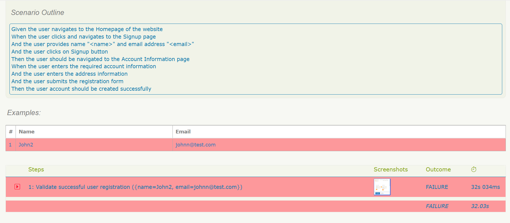

#Selenium -Serenity BDD Test Framework

This is a UI Test Automation Framework built using Selenium, Serenity BDD, Cucumber and JUnit 5. It follows the Page Object Model (POM) with a layered architecture to produce readable, maintainable and reusable automated UI tests.
---

## 📋 Tech Stack

- **Programming Language:** Java (JDK 21)
- **Test Framework:** Serenity BDD with Cucumber
- **Browser Automation Tool:** Selenium
- **Build Tool:** Maven
- **Reporting Tool:** Serenity BDD Reports
- **Dependency Management:** Maven Dependency Management
- **Test Runner:** JUnit5

---

## 📂 Project Structure

Here is an overview of the project structure:


---

## ✅  Features Automated

### Registration

- Register a new user
- Verify successful account creation

### Login

- Successful login
- Invalid login validation

### Product Search

- Search for a product
- Verify search results
- Add product to cart

### Checkout

- Login with registered user
- Search and add product to cart
- Proceed to checkout
- Enter payment details
- Place order
- Verify successful order placement

---

# Test Data

The framework separates test data from test logic.

- Registration test data is maintained using a dedicated test data class.
- Checkout payment details are maintained separately for improved maintainability and readability.

---

# Synchronization

The framework uses Serenity's explicit synchronization methods such as:

- `waitUntilVisible()`
- `waitUntilClickable()`
- `shouldbeVisible()`
- `shouldbeContainText()`

No implicit waits are used.

---

# Cookie Handling

The framework automatically accepts the cookie consent popup before interacting with the application to prevent it from blocking UI elements.

# Running the Tests

Run the complete test suite:

```bash
mvn clean verify
```

Run an individual feature runner:

```bash
mvn -Dtest=<RunnerClassName> test
```

Example:

```bash
mvn -Dtest=LoginRunner test
```

---
# Serenity Reports

After execution, the Serenity HTML report can be viewed at:

```
target/site/serenity/index.html
```

 **Serenity Dashboard**


---

# Failure Screenshots

Screenshots are automatically captured for failed test steps using Serenity.

Configuration:

```properties
serenity.take.screenshots=FOR_FAILURES
```

**Failed Scenario Screenshot**



---

# Design Highlights

- Page Object Model (POM)
- Layered architecture (Steps → Actions → Pages)
- Reusable Action classes
- Separate Test Data classes
- Explicit wait strategy
- Serenity HTML Reporting
- Maven Build Management
- Independent test scenarios

---

# Assumptions

- Each scenario is designed to be independent.
- Selenium Manager automatically manages browser drivers.
- Test data is created during execution where applicable.

---

## Getting Started

### Prerequisites
- Java JDK 21 or later
- Apache Maven 3.9+
- Google Chrome (latest version)
- IntelliJ IDEA (or any Java IDE)
- Git (optional, for cloning the repository)
> **Note:** Browser drivers are managed automatically by Selenium Manager, so no manual ChromeDriver setup is required.

# Known Limitations

- Cookie consent is handled automatically before interacting with the application.
- The test website may occasionally display random promotional or advertisement overlays that are not consistently reproducible. These overlays are part of the application behavior and may occasionally require manual dismissal if they obstruct UI interactions.
- Browser maximization behaviour may vary depending on the browser and execution environment. The framework does not rely on browser size for test stability.
---

# Future Enhancements

- Parallel execution
- Cross-browser execution
- Externalize test data to JSON/Excel
- CI/CD integration (Jenkins/GitHub Actions)
- Common Hooks for shared setup and teardown  
    
